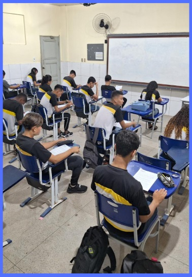

::: {.content-visible when-format="html"}

:::: progress
::: {.progress-bar style="width: 100%;"}
:::
::::

:::

# O Que é a Metodologia da Transitividade

A Metodologia da Transitividade é uma proposta pedagógica, de forte inspiração Freiriana, que visa conduzir o estudante da percepção imediata e ingênua de sua realidade para uma compreensão estrutural e crítica.

{fig-align="center" width="40%"}

Seus objetivos educacionais centrais incluem romper com a educação “bancária”, integrar o currículo escolar à vida real dos educandos e formar sujeitos capazes de analisar e intervir em sua realidade.

## Princípios Centrais

- **Diálogo**: Relação horizontal entre educador e educando.
- **Leitura Crítica da Realidade**: Partir do contexto vivido pelo aluno.
- **Articulação Teoria-Prática**: Integração entre conhecimento e realidade.
- **Passagem da Ingenuidade à Criticidade**.
- **Protagonismo Estudantil**.

::: {.callout-tip collapse="false"}
**EM SÍNTESE:** A Metodologia da Transitividade utiliza a investigação do cotidiano para promover uma leitura crítica da realidade e fortalecer a autonomia intelectual dos estudantes.
:::

::: {.content-visible when-format="html"}

:::: progress
::: {.progress-bar style="width: 100%;"}
:::
::::

:::

