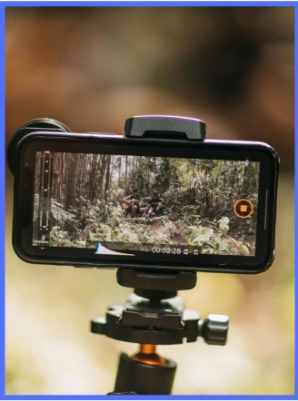

```{=html}
<style>
  body{text-align: justify}
</style>
```

:::: progress
::: {.progress-bar style="width: 100%;"}
:::
::::

# Porque Trabalhar com Vídeos Educativos para Redes Sociais no Ensino Médio

O uso de dispositivos móveis, especialmente o celular, é uma realidade inegável na cultura juvenil contemporânea. No entanto, o ambiente escolar frequentemente enxerga essa tecnologia apenas como uma distração ou, no máximo, como um recurso passivo para consumo de informações. Integrar as linguagens audiovisuais próprias das redes sociais ao fazer pedagógico é uma forma de disputar os sentidos e os usos dessas tecnologias.

{fig-align="center" width="295"}

A proposta aqui apresentada não visa transformar a sala de aula em uma agência de criação de conteúdo. Pelo contrário, trata-se de utilizar a câmera do celular como uma “lente investigativa”. Ao propor que os estudantes produzam vídeos para as redes sociais, o professor exige deles processos complexos: observação atenta do espaço, seleção do que é relevante, elaboração de um roteiro argumentativo e expressão estética de uma ideia.

Ao registrar o cotidiano, o aluno é forçado a olhar para o que antes lhe parecia natural. A edição do vídeo se torna um exercício de análise social, onde a imagem codifica a realidade e a discussão em sala de aula descodifica suas contradições.

::: {.callout-tip collapse="false"}
"**IDÉIA CENTRAL** : Na prática, a produção de vídeos para redes sociais na escola não busca o entretenimento ou a viralização, mas sim o uso da linguagem audiovisual como ferramenta para investigar, problematizar a realidade concreta e construir autoria crítica entre os jovens.".
:::

:::: progress
::: {.progress-bar style="width: 100%;"}
:::
::::

:::: progress
::: {.progress-bar style="width: 100%;"}
:::
::::
