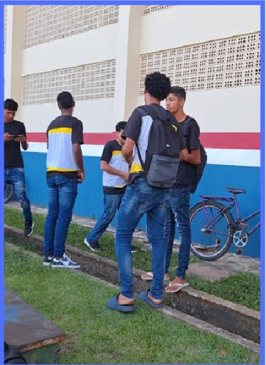

::: {.content-visible when-format="html"}

:::: progress
::: {.progress-bar style="width: 100%;"}
:::
::::

:::

# Passo a Passo Metodológico

A aplicação da Metodologia da Transitividade ocorre de forma processual, estruturada em etapas lógicas que conduzem os estudantes da observação à síntese crítica.

:::: {.columns}

::: {.column width="60%"}

1. **Organização Inicial**

2. **Diálogo com os Alunos**

3. **Diálogo com a Realidade**

4. **Investigação da Área de Estudo**

5. **Codificação das Experiências Sociais**

6. **Diálogos Descodificados**

7. **Redução Temática**

8. **Desenvolvimento em Sala de Aula**

9. **Apresentação dos Vídeos e Avaliação**

:::

::: {.column width="40%"}

{fig-align="center" width="100%"}

:::

::::

---