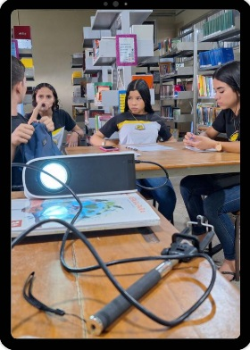
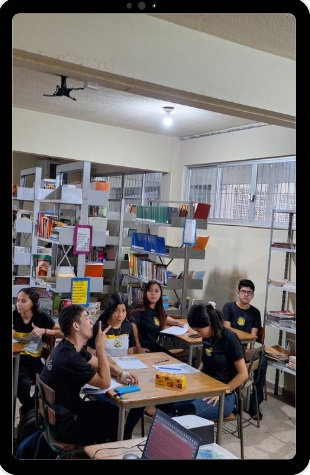

::::: {.content-visible when-format="html"}
:::: progress
::: {.progress-bar style="width: 100%;"}
{fig-align="center"}
:::
::::
:::::

# Detalhamento das Etapas

## Organização Inicial

**Objetivo:** O professor apresenta a proposta, explicando que a atividade não consiste apenas em “gravar um vídeo”, mas em investigar a realidade e transformá-la em leitura crítica. Também organiza os grupos, define prazos, conversa sobre uso responsável de imagem, ética digital e finalidade pedagógica da produção.

**O que os estudantes fazem:** Compreendem a intencionalidade do trabalho, formam suas equipes de investigação e começam a debater possíveis temas.

{fig-align="center" width="40%"}

::::: {.content-visible when-format="html"}
:::: progress
::: {.progress-bar style="width: 100%;"}
:::
::::
:::::

## Diálogos com os Alunos

Nesse momento inicial, o professor promove uma roda de conversa para ouvir os estudantes sobre questões que merecem ser discutidas. Em vez de começar pelo conteúdo pronto, inicia pela experiência vivida pelos alunos.

Esse movimento aparece como um momento de aproximação e escuta, coerente com o processo educativo dialógico.

{fig-align="center" width="40%"}

### Exemplos de Perguntas Problematizadoras

-   O que mais incomoda vocês na escola ou no bairro?
-   Que situações todo mundo vê, mas quase ninguém discute?
-   Se vocês pudessem denunciar, explicar ou conscientizar sobre algo em 1 minuto, o que seria?
-   Que tipo de vídeo vocês consomem nas redes sociais que prende mais atenção?

### Exemplo de Atividade em Sala

Cada aluno escreve em um post-it ou formulário:

1.  um problema que observa;
2.  uma pergunta que gostaria de investigar;
3.  uma ideia de vídeo curto sobre esse problema.

### Produto Esperado

-   Mapa de interesses da turma.

::::: {.content-visible when-format="html"}
:::: progress
::: {.progress-bar style="width: 100%;"}
:::
::::
:::::

## Diálogos com a Realidade

Dialogar com os alunos significa incentivá-los a observar a realidade de forma mais atenta, saindo de opiniões genéricas e avançando para observações concretas.

{fig-align="center" width="40%"}

O professor conduz uma atividade de leitura do espaço escolar ou do entorno. O importante aqui é deslocar o olhar:

-   “o que vemos?”;
-   “quem aparece?”;
-   “quem não aparece?”;
-   “que contradições existem?”.

Esse momento prepara os estudantes para observar criticamente seu contexto antes do registro audiovisual.

### Exemplos de Perguntas Problematizadoras

-   O que mais incomoda vocês na escola ou no bairro?
-   Que situações todo mundo vê, mas quase ninguém discute?
-   Se vocês pudessem denunciar, explicar ou conscientizar sobre algo em 1 minuto, o que seria?
-   Que tipo de vídeo vocês consomem nas redes sociais que prende mais atenção?

### Exemplo de Atividade Prática

Se o tema for lixo no entorno da escola, os alunos podem observar:

-   onde há mais lixo acumulado;
-   em quais horários isso acontece;
-   se há lixeiras suficientes;
-   quem é responsabilizado pelo problema;
-   como moradores ou estudantes percebem essa situação.

### Sugestão de Recurso

Use uma ficha simples de observação com três colunas:

-   o que vimos?;
-   por que isso acontece?;
-   que pergunta isso gera?

### Produto Esperado

-   Registro de observações e primeiras hipóteses.

::::: {.content-visible when-format="html"}
:::: progress
::: {.progress-bar style="width: 100%;"}
:::
::::
:::::

## Investigação da Área de Estudo

É o momento de construir o levantamento preliminar do tema escolhido de modo mais sistemático.

O professor dialoga com os alunos sobre a coleta inicial de relatos, cenas, imagens e falas significativas. Trata-se da primeira etapa da investigação temática, quando ocorre o levantamento preliminar da realidade estudada.

Os estudantes definem o que querem descobrir, quem pretendem entrevistar e em quais espaços realizarão as filmagens.

{fig-align="center" width="40%"}

### Exemplo de Temática

“As dificuldades de mobilidade que os alunos enfrentam para chegar à escola”.

### Miniatividade Investigativa

-   Qual é o problema?
-   Onde ele aparece?
-   Quem é afetado?
-   Como ele costuma ser explicado?
-   O que ainda precisamos descobrir?

### Produto Esperado

-   Um dossiê inicial do tema com anotações, fotos, falas e perguntas.

::::: {.content-visible when-format="html"}
:::: progress
::: {.progress-bar style="width: 100%;"}
:::
::::
:::::

## Codificação das Experiências Sociais

É o momento de transformar situações reais em materiais de registro: fotos, áudios, vídeos, entrevistas e cenas do cotidiano.

De acordo com a concepção freiriana, a codificação consiste em registrar aspectos da realidade para que posteriormente eles possam ser analisados. Essa é a fase da captação de “retratos” da realidade.

{fig-align="center" width="40%"}

O professor, juntamente com os alunos, apresenta noções básicas como:

-   técnicas de enquadramento;
-   plano aberto, médio e close;
-   captação de áudio;
-   iluminação;
-   gravação vertical ou horizontal para Reels, TikTok e Shorts;
-   autorização de imagem em entrevistas gravadas.

### Atividades que as Equipes Podem Realizar

-   coletar opiniões de colegas;
-   registrar a chegada dos alunos;
-   realizar enquetes sobre riscos identificados no trajeto;
-   fotografar e filmar vias do bairro, ciclovias, faixas de pedestres e pontos de ônibus;
-   registrar o trânsito no entorno da escola.

### Exemplos de Gravações

-   alunos nos pontos de ônibus;
-   alunos utilizando bicicletas nas ciclofaixas;
-   entrevistas curtas com estudantes;
-   cenas de deslocamento de pedestres;
-   fala em off com dados ou reflexões.

### Modelo de Vídeo-Denúncia em 45 Segundos

1.  abertura com pergunta forte;
2.  cenas do problema;
3.  fala de dois colegas;
4.  dado simples;
5.  conclusão com proposta.

### Produto Esperado

-   Banco de imagens e vídeos do grupo.

::::: {.content-visible when-format="html"}
:::: progress
::: {.progress-bar style="width: 100%;"}
:::
::::
:::::

## Diálogos Descodificadores

É o momento em que educandos e educadores interpretam criticamente o material produzido.

Essa é uma etapa decisiva. O professor exibe os registros e conduz a análise coletiva:

-   o que o vídeo mostra?;
-   o que ele esconde?;
-   que contradições aparecem?;
-   que causas estruturais podem estar por trás?

Essa etapa permite sair da aparência imediata e avançar para uma problematização crítica.

### Perguntas de Descodificação

-   O que aparece com mais força nas imagens?
-   Que problema social está sendo revelado?
-   Isso é um caso isolado ou algo recorrente?
-   Quem ganha e quem perde com essa situação?
-   Como a escola, a comunidade ou o poder público entram nisso?
-   O vídeo reforça apenas questões comportamentais ou ajuda a pensar o problema de forma coletiva?

### Exemplo de Problematização

Caso a codificação tenha sido sobre os alunos no trânsito, podem surgir novas discussões:

-   os problemas do trânsito são apenas consequência da imprudência?;
-   quais riscos os estudantes identificam no trajeto até a escola?;
-   as vias do bairro são seguras e bem sinalizadas?;
-   quem é responsável pelo trânsito no município?

### Produto Esperado

-   Uma síntese crítica do tema em cinco a oito frases.

::: {.callout-tip collapse="false"}
## Outro Exemplo Prático

Caso o tema fosse a merenda escolar, após observar os registros codificados, a turma poderia discutir:

-   o problema é quantidade, qualidade ou organização escolar?;
-   os estudantes apenas reclamam ou conseguem analisar melhor a questão?;
-   o vídeo está culpando indivíduos específicos ou analisando um problema estrutural?;
-   como apresentar o problema com responsabilidade?
:::

::::: {.content-visible when-format="html"}
:::: progress
::: {.progress-bar style="width: 100%;"}
:::
::::
:::::

## Redução Temática

A finalidade é delimitar o foco central do vídeo para que ele se torne claro, coerente e pedagogicamente significativo.

Após a discussão, o professor auxilia os estudantes a definir qual aspecto do problema será abordado. Nessa etapa, o tema investigado é recortado para ganhar forma educativa.

### Perguntas Norteadoras

-   O que aparece com mais força nas imagens?
-   Que problema social está sendo revelado?
-   Isso é um caso isolado ou recorrente?
-   Quem ganha e quem perde com essa situação?
-   Como escola, comunidade e poder público aparecem nesse contexto?
-   O vídeo contribui para reflexão crítica coletiva?

### Exemplo de Tema

“Saúde mental na escola”.

Possíveis recortes:

-   pressão por desempenho;
-   excesso de tarefas;
-   falta de escuta;
-   impacto das redes sociais;
-   comparação entre colegas.

::: {.callout-tip collapse="false"}
## Atividade Prática

Cada grupo completa a frase:

-   “Nosso vídeo vai mostrar que \_\_\_\_\_\_\_\_\_\_, porque observamos \_\_\_\_\_\_\_\_\_\_, e queremos que o público reflita sobre \_\_\_\_\_\_\_\_\_\_.”

### Produto Esperado

-   Tema final com a mensagem central do vídeo.
:::

::::: {.content-visible when-format="html"}
:::: progress
::: {.progress-bar style="width: 100%;"}
:::
::::
:::::

## Desenvolvimento em Sala de Aula

É a etapa de roteirização, edição e finalização do material audiovisual.

Nesse momento, o conteúdo investigado transforma-se em produto didático.

### Exemplos de Estrutura para Vídeo Curto

#### Modelo 1 — Vídeo Explicativo

-   gancho inicial: “Você já percebeu que...?”;
-   apresentação do problema;
-   imagens do cotidiano;
-   falas ou dados curtos;
-   análise crítica.

#### Modelo 2 — Minidocumentário Curto

-   cena inicial de impacto;
-   narração breve;
-   entrevista curta;
-   contraste entre falas e imagens.

### Exemplo Prático

**Tema:** “Lixo no Bairro”

Roteiro em 60 segundos:

-   0–5s: imagem do problema e pergunta;
-   5–20s: cenas do entorno;
-   20–35s: fala de morador ou estudante;
-   35–50s: interpretação do grupo;
-   50–60s: proposta de reflexão ou ação.

::: {.callout-tip collapse="false"}
## Atividade Prática

Sem depender de recursos complexos, os alunos podem utilizar editores simples de celular para:

-   cortar cenas;
-   inserir legendas;
-   adicionar títulos;
-   organizar a sequência das imagens;
-   inserir trilha sonora sem prejudicar a compreensão das falas.

### Produto Esperado

-   Vídeo finalizado.
:::

## Apresentação dos Vídeos e Avaliação

É o momento de socialização das produções, reflexão sobre o processo e avaliação das aprendizagens.

Essa etapa corresponde à finalização do percurso metodológico com a apresentação dos vídeos e comentários sobre as experiências vividas.

### Como Avaliar?

A avaliação pode considerar:

-   coerência entre tema e vídeo;
-   qualidade da investigação;
-   capacidade de análise crítica;
-   clareza da mensagem;
-   organização do grupo;
-   uso ético e responsável da linguagem audiovisual.

### Exemplo de Fechamento Reflexivo

Cada equipe responde:

-   O que aprendemos sobre o tema?
-   O que aprendemos sobre fazer vídeo?
-   Nossa produção apenas mostrou um problema ou ajudou a compreendê-lo?
-   Se fôssemos publicar, que impacto gostaríamos de gerar?

### Produto Esperado

-   Exibição, autoavaliação e debate final.

::::: {.content-visible when-format="html"}
:::: progress
::: {.progress-bar style="width: 100%;"}
:::
::::
:::::

