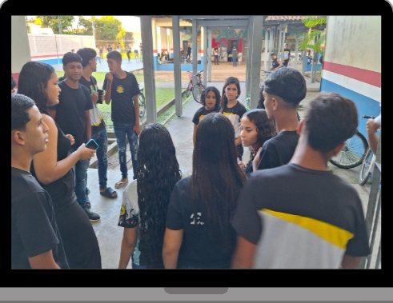

# Cuidados Éticos e Pedagógicos

::: {.content-visible when-format="html"}

:::: progress
::: {.progress-bar style="width: 100%;"}
:::
::::

:::

O trabalho com imagens na escola contemporânea exige rigorosa atenção
ética. Ao solicitar aos estudantes que produzam registros audiovisuais
da realidade, o professor deve promover discussões sobre os limites da
exposição pública e da responsabilidade social na produção de conteúdo.

{fig-align="center" width="40%"}

## Direitos de Imagem

Não é permitido gravar e expor pessoas sem autorização expressa,
especialmente em ambientes vulneráveis ou dentro do espaço escolar,
envolvendo menores de idade.

A autorização documentada deve ser compreendida não apenas como
procedimento legal, mas também como prática pedagógica voltada à
formação cidadã e ao respeito à privacidade.

## Respeito à Dignidade Humana

O olhar crítico não deve assumir caráter persecutório ou humilhante.

A investigação de contradições sociais não pode expor trabalhadores,
alunos, professores ou moradores a situações de constrangimento público.

O objetivo pedagógico consiste em compreender os problemas sociais e não
ridicularizar indivíduos.

## Crítica ao Sensacionalismo

As redes sociais frequentemente operam sob a lógica do espetáculo, da
viralização e da chamada “lacração”.

O vídeo escolar, entretanto, deve assumir função investigativa,
reflexiva e educativa.

Cabe ao professor problematizar:

- exageros narrativos;
- informações descontextualizadas;
- manipulações audiovisuais;
- trilhas sonoras apelativas;
- discursos que reforcem preconceitos ou estigmas sociais.

## Checagem de Informações

Qualquer dado estatístico, denúncia ou afirmação apresentada nos vídeos
deve passar por verificação rigorosa antes da edição final.

Os estudantes precisam compreender a importância da:

- confirmação de fontes;
- responsabilidade informacional;
- ética na comunicação;
- veracidade dos dados apresentados.

::: {.callout-tip collapse="false"}
## Reflexão Pedagógica

Produzir vídeos na escola não significa apenas aprender técnicas de
filmagem ou edição. Significa também desenvolver responsabilidade ética,
consciência crítica e compromisso social no uso das linguagens digitais.
:::

::: {.content-visible when-format="html"}

:::: progress
::: {.progress-bar style="width: 100%;"}
:::
::::

:::