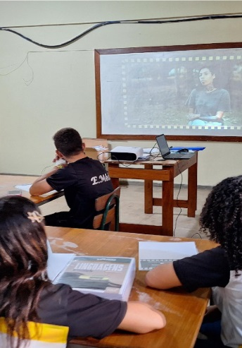

# Considerações Finais

::: {.content-visible when-format="html"}

:::: progress
::: {.progress-bar style="width: 100%;"}
:::
::::

:::

A aplicação da Metodologia da Transitividade por meio da produção
audiovisual representa uma intervenção pedagógica significativa em favor
de uma escola mais conectada à realidade social dos estudantes.

Ao longo deste guia prático, evidenciou-se que o verdadeiro potencial
dos dispositivos móveis na sala de aula não reside no consumo passivo de
conteúdo, mas na capacidade de transformar os estudantes em sujeitos
investigadores de sua própria realidade.

{fig-align="center" width="40%"}

Nesse percurso, que vai da codificação visual do cotidiano aos diálogos
descodificadores, o estudante transita de uma postura observadora e
ingênua para uma postura investigativa, consciente e reflexiva.

Produzir vídeos para redes sociais deixa de ser apenas um ato de
exposição pessoal e passa a constituir-se como exercício ético, autoria
discursiva e intervenção cultural crítica.

A linguagem audiovisual, quando articulada ao trabalho pedagógico,
possibilita:

- desenvolvimento da leitura crítica da realidade;
- fortalecimento do protagonismo estudantil;
- integração entre teoria e prática;
- ampliação das formas de expressão juvenil;
- construção de consciência social e cidadã.

Nesse sentido, o professor deixa de ocupar exclusivamente a posição de
transmissor de conteúdos e assume o papel de mediador da investigação,
da reflexão e da problematização da realidade social.

A escola, por sua vez, transforma-se em espaço de produção de sentidos,
diálogo crítico e formação democrática.

## Referência Base

A organização estrutural, pedagógica e teórica deste e-book foi
consolidada a partir da sistematização de informações e análises
oriundas da dissertação de mestrado:

> *O recurso do audiovisual no ensino de Sociologia: o uso do celular na
> produção de minidocumentários para o exercício da metodologia da
> transitividade.*

::: {.callout-tip collapse="false"}
## Síntese Final

A Metodologia da Transitividade demonstra que o uso pedagógico das
tecnologias digitais pode ultrapassar o entretenimento e converter-se em
instrumento de investigação social, formação crítica e construção de
autonomia intelectual no ensino médio.
:::

::: {.content-visible when-format="html"}

:::: progress
::: {.progress-bar style="width: 100%;"}
:::
::::

:::