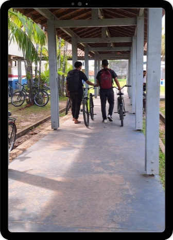

::: {.content-visible when-format="html"}

:::: progress
::: {.progress-bar style="width: 100%;"}
:::
::::

:::

# Introdução

No contexto do Novo Ensino Médio as atividades educativas que tem a proposta pedagógica de mediar o conhecimento sistematizado com o conhecimento sobre a vida prática, permitem que os professores em diálogo com os alunos tenham uma compreensão mais elaborada sobre a produção do conhecimento. A proposta de produção do audiovisual adotada, possui como estratégia o aprofundamento dos saberes dos alunos pela apropriação dos instrumentos teóricos a partir das vivências sociais, a fim de criar mecanismos de ação sobre a reflexão feita sobre os problemas observados no cotidiano, ou seja, através do uso de celular pelos alunos busca-se uma forma de mediar o conhecimento pelo contexto vivenciado pelo aluno.

{fig-align="center" width="187"}

Esta proposta da Metodologia da Transitividade, orientada pela produção de minidocumentários e de outras mídias audiovisuais, permite o seu compartilhamento como conteúdos educacionais nas redes sociais. Também visa fundamentar a produção de diversos conteúdos de visualização rápida para postagem nas redes sociais mais utilizadas pelos alunos no Instagram Reels, TikTok, Facebook Reels, Youtube shorts e Kwai.

A metodologia utilizada nas oficinas nas atividades para o desenvolvimento do produto, foi a forma encontrada em desenvolver um produto de forma preliminar, porém considera-se que os resultados dessas experiências registradas no Guia Prático da Metodologia da Transitividade, podem ser aplicadas seguindo o formato de oficinas ou adequada às aulas de sociologia ou à critério de cada professor, conforme a sua realidade.

A intenção com essa experiência prática é que possamos apresentar uma metodologia de ensino para que professores trabalhem com os educandos uma forma prática para aprendizagem de conteúdos sociológicos. Portanto, o objetivo não é apresentar um plano de aula, mas um Guia Metodológico onde o professor possa adaptá-lo às suas necessidades de ensino, adequado à cada contexto onde exerce a docência no suporte à produção de audiovisual.

::: {.content-visible when-format="html"}

:::: progress
::: {.progress-bar style="width: 100%;"}
:::
::::

:::

